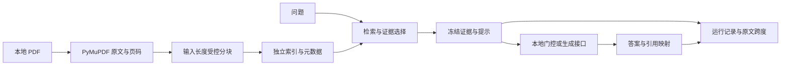

# ChemQA 技术报告

版本日期：2026-10-08。项目为2025年原型的2026年分阶段重构；事实和数值对应下方冻结记录。本报告说明已经完成的实现和本机观察，不将计划、模型调用或探索性评分写成训练成果与质量保证。

## 1. 问题与最终决定

原型连接PDF、向量搜索和生成接口，但片段身份/来源位置、输入长度、生成失败状态与独立运行记录不足以支持可核查比较。重构首先建立证据和运行契约，再逐步隔离试验模型、分块、存储、混合召回、重排和上下文选择。

最终保留MiniLM/JSON兼容默认；J显式运行固定Paratera Flash非思考生成配置，并提供Qwen/H和Qwen/H/I两套显式实验profile。无profile入口仍遵循环境配置。J冻结代码、依赖、索引、参数及评审覆盖层；缺失或漂移先报错。Q10-B没有支持切换默认的充分证据，也没有旧MiniLM同条件生成对照；保留是审慎的采用决定，不是旧默认更优的实测结论。

## 2. 实现与可追溯性

PDF字节SHA-256定义 `doc_id`；文献、片段序号和精确文本共同定义 `chunk_id`。源位置为PDF物理页及提取文本半开字符区间；合并空白保留原始跨度，不能从字符串位置推导页面高亮坐标。重复导入合并相同身份并保留来源别名。模型输入按tokenizer的实际完整序列校验，包含查询前缀及特殊token，超限拒绝，不依赖静默截断。

现有本地语料181文件、180份不同PDF。兼容索引26,025片段、384维；候选6,960片段、1024维。E使用页内512-token窗口、目标重叠64；旧MiniLM上限128、目标重叠16。分块数量差异同时反映窗口长度，不能当作质量提升本身。[Q03](Q03_TEXT_PROCESSING.md)、[E原文/构建](Q06_5E_EMBEDDING.md)

兼容路径使用JSON与精确余弦检索、top10及0.5上下文阈值；阈值未作科学正确率校准。候选使用NumPy float32向量、只读mmap及SQLite元数据，精确余弦、BM25/RRF固定候选与Qwen reranker。BM25/RRF/logits不是余弦，不能套用旧阈值。H只重排相同50候选；I控制每篇片段数和原文跨度重叠。完整manifest固定模型revision、词法参数、来源文件和校验值。[F](Q06_5F_STORAGE.md)、[G](Q06_5G_HYBRID.md)、[H](Q06_5H_RERANKING.md)、[I](Q06_5I_CONTEXT.md)

生成输入为版本化证据JSON，原文作为数据处理；只允许引用本次输入中的完整chunk ID。空证据在本地停止，非空证据提示核对目标体系、条件和支持层级。输出将标记映射为文献/物理页/原文，同时保留未解析引用。提示约束不是可靠执行的证明。[Q05](Q05_PROMPT_CONTRACT.md)、[Q06](Q06_EVIDENCE_BOUNDARIES.md)

接口返回明确的成功、空证据、失败或截断状态，保存usage、尝试、finish reason和响应模型标识。单次运行以暂存目录验证后发布；失败不生成正常答案。候选ready后只读，新构建不覆盖旧索引。密钥外置，记录不复制密钥。[Q07](Q07_API_RESULTS.md)、[Q08](Q08_REPRODUCIBILITY.md)

## 3. 分阶段实测与未采用方案

| 阶段 | 已记录观察 | 解释边界 |
| --- | --- | --- |
| D解析 | 10篇选页对照后保留PyMuPDF | Docling部分表格有收益，但原文映射/公式/OCR未满足迁移；不是全库解析正确证明 |
| E模型/分块 | 全库18开发正例的完整锚点召回@10：旧MiniLM5.6%、Qwen页内窗口62.0% | 是模型与分块联合差异、同top-k文本预算不同；非答案准确率 |
| F存储 | 同6,960行逐位向量与完整元数据一致，前十排名/分数差0；221.6→61.3 MiB | 同向量条件下的存储变化，不产生检索质量提升 |
| F性能 | 三进程基准加载中位数2.07→0.37 s，单检索8.11→1.12 ms | 本机、暖身与缓存未严格受控；不含模型加载/查询编码，非端到端承诺 |
| G混合召回 | 开发完整锚点召回@10：Dense62.0%、混合70.37% | 基于非穷尽草案标签，仍有漏召回 |
| H重排 | 固定50候选后70.37→85.19%，每题新增耗时中位数7.62 s | 开发集探索性收益与代价，非独立科学回答对照 |
| I选择 | 每篇6片段策略后85.19→82.41%，D08回退 | 不强制采用全部新组件，保留实验策略 |

数据取自对应阶段记录，不在Q11重新跑基准。F的FAISS/PyTorch同进程OpenMP冲突实测导致退出134，最终采用NumPy/SQLite，未使用不安全环境绕过；不将FAISS写成已采用功能。BGE未进行本轮对照，不能宣称Qwen优于BGE。[F完整基准](Q06_5F_BENCHMARK.json)、[D](Q06_5D_PARSING.md)、[E](Q06_5E_EMBEDDING.md)

## 4. Q10-B生成比较与评审

在候选、提示、预算及重复规则冻结后，一次性使用6个原预留问题。Direct、BM25、Dense、Hybrid+reranker、+diverse各3次，共90次，全部正常返回；使用第三方DeepSeek-V4-Flash、非思考、temperature0.3、max_tokens4096、单次尝试。Direct无检索，另用明确不确定性模板；四个RAG方案共用证据/边界模板。公共上限10片段与输入32,000字节估算，I另限制每篇6与跨度0.5。字节预算不是供应商精确token数。[协议](../config/q10b_protocol.json)

| 方案 | 冻结要点宏平均 | 条件/单位均分（0–2） | 证据支持均分（0–2） |
| --- | ---: | ---: | ---: |
| Direct | 15.28% | NA | NA |
| BM25 | 77.78% | 1.93（15份适用） | 1.89（18份适用） |
| Dense | 100% | 1.72（18份） | 1.61（18份） |
| Hybrid+reranker | 100% | 1.61（18份） | 1.50（18份） |
| +diverse | 100% | 1.78（18份） | 1.72（18份） |

这是用户指定的单个AI助手专家评审，非独立研究者、非盲评；评分先平均同题3次，再平均6题。核心要点不是整份回答全部主张，不能将满分称作准确率100%。Direct的NA与缺少目标事实导致要点零分分别处理；BM25无目标证据时有界拒答也不计任务完成。完整评分及分母见 [评审报告](Q10B_EXPERT_REVIEW.md)、[JSON](Q10B_EXPERT_RESULTS.json)。

观测到的主要问题包括：R01最大浓度与恒电位条件混用；R02从丢电荷/负号的PDF文本补出错误反应式；R03将KIE实验条件称为标准条件；R05原文异常负百分比未充分提示、无对照的表述过强及题目接受范围歧义；R06优化中间温度与最终性能绑定。原文损坏、源论文异常和生成错误分别记录。R05排除敏感性分析没有区分三个Qwen候选的要点得分。

40题标签有来源锚点：17份文献、51区间核验通过；实际生成证据35份PDF、121独立片段/原始跨度核验通过。四个RAG方案标记结构映射率均100%，但并不能排除上述科学错误；未穷举全体事实主张，不报告claim support precision/recall。6题均可回答，不能评价整体证据不足识别。三重复不增加独立论文样本，14个派生开发题也不增加论文数。[助手核验](Q10B_EXPERT_VALIDATION.json)

供应商返回501,441输入及127,070输出tokens，共628,511；价格未核验，费用为null。API中位数Direct8.36、BM2512.12、Dense14.00、H13.81、I12.80秒，未包含检索，不能作为端到端速度排名。模型名只代表平台声明，不证明底层权重revision。[工程汇总](Q10B_RESULTS.json)

## 5. 冻结、复现与交付范围

J的三套profile绑定本地索引/源码/依赖/参数/评审覆盖层，显式入口保存manifest SHA。无profile入口仍按环境配置，不声称冻结运行。回退选择 `legacy`即可，不删除候选。当前245项离线回归通过；J实际MiniLM/CPU加载26,025片段和本地检索再次通过，生成参数等于Q10-B协议，没有调用API。[运行manifest](../config/q065j_runtime.json)、[J收尾](Q06_5J_CLOSEOUT.json)

源码、锁文件和小型记录可以检查实现；重放还需要本地PDF、模型revision缓存、原索引和原回答目录。历史开发Git有用户确认撤销的旧凭据，采用Q09无历史源码快照路径，未重写/推送原历史。源码快照不含PDF/模型/向量文件，但文档和评估文件仍包含文献摘录与本地路径；不等同完整可运行归档或已清除再分发边界的公开包。[运行手册](RUNBOOK.md)

## 6. 可据实使用的项目描述

> ChemQA — Evidence-grounded QA for electrochemistry literature (2025 prototype; 2026 refactor). Implemented stable document/chunk identities, source-page tracing, isolated index and answer artifacts, and explicit API failure handling. Compared pinned embedding/chunking, NumPy/SQLite storage, BM25/RRF retrieval and reranking candidates; conducted a frozen five-arm, three-repeat generation comparison with auditable assistant-reviewed error analysis.

使用时按实际个人贡献调整“Implemented”等措辞，并如实说明AI辅助。可以陈述本地语料规模、实现能力和明确实验设置；不写“自行训练大模型”“FAISS生产检索”“科学准确率100%”“全部引用得到科学验证”或缺少同条件数据的端到端加速/费用节省。

## 7. 后续问题

公式符号保真、条件绑定、谨慎但过强的缺证据断言及原文异常值提示需要独立修订；不是Q11文档收尾时顺带更改提示或参数。未来应准备新的未使用验收问题、补足旧默认同条件生成对照与独立领域复核。已消费预留题可用于错误分析，不能调参后继续冒充独立测试。本轮验收见 [Q11记录](Q11_DOCUMENTATION.md)。

## R01 后续工程修订（2026-10-08）

当前问答新增保守提示和有限的数值/引用、反应式、异常值及证据缺失措辞检查，违规输出作为失败诊断保存。新增18项合成检查，完整263项离线回归通过；没有新模型调用或独立科学比较。前述 Q10-B 分数、收益与延迟属于旧实现，不能移植为 R01 的测量结果。工况语义对应仍依赖生成约束与原页复核，未实现自动科学正确性证明。实现、适用入口及边界见 [R01说明](R01_ANSWER_RELIABILITY.md)。
