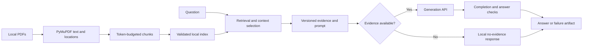

# Architecture and evidence flow

ChemQA connects local literature retrieval with remote answer generation while keeping the intermediate evidence inspectable. The main interface is a CLI. It uses pretrained models; the repository contains application and evaluation code rather than model training.

Identity and location are separate contracts. Hashing PDF bytes prevents filename collisions from becoming citation identity collisions. Page-local text spans make saved evidence auditable, but do not assert that extraction preserved the scientific notation on the page.

The default index stores JSON and scores cosine similarity with NumPy. The experimental path stores the same kind of evidence in NumPy arrays and SQLite, adds BM25/RRF candidate retrieval, and reranks a fixed candidate pool. These steps answer different questions: representation affects which passages can match; storage affects how they are loaded; reranking changes order within an already retrieved set; context selection controls what reaches generation.

A prepared prompt freezes normalized evidence for generation, formatting, and citation analysis. Full chunk IDs survive display formatting. Empty evidence stops locally. A complete remote response then passes limited answer checks before publication. Failures remain separate artifacts so an API error, truncated answer, or rejected generation cannot be mistaken for a successful answer.

Candidates and single-run artifacts are staged and published independently. Frozen profiles additionally bind source, configuration, dependencies, and local experiment assets by hash. This supports inspection of the exact implementation and input; it does not guarantee remote model immutability or future identical prose.

Implementation entry points: [expert system](../../src/qa_system/expert_system.py), [index builder](../../src/pipeline/vector_index_builder.py), [retriever](../../src/knowledge_base/retriever.py), and [runtime profiles](../../src/qa_system/runtime_profile.py).

[Contracts](../reference/artifact-contracts.md) · [Decisions](../decisions/README.md) · [Documentation home](../README.md)
